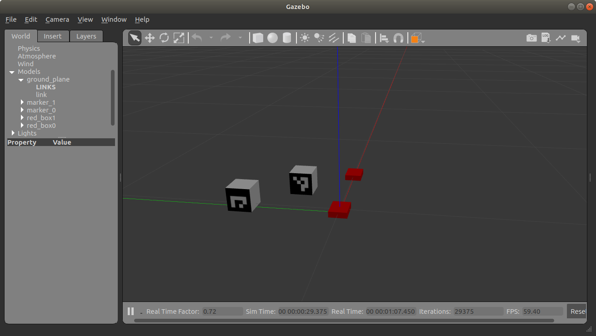

## ROS spawn urdf or sdf in Gazebo simulation
This repository will help in spawning urdf or sdf file in gazebo using Python, C++ or roslaunch file. This repository also contains different aruco_marker cube's models for detection.

### Requirements
- Ubuntu 18.04
- [ROS](http://wiki.ros.org/melodic/installation/ubuntu)
- [Gazebo](http://gazebosim.org/tutorials?tut=install_ubuntu)
- Pyton 2.7
- This code is tested with ROS melodic, can be run in Kinetic and noetic

### how to us the repository
- Assuming your universal robot workspace is named as `catkin_ws`, download the repository to `catkin_ws/src/`
  ```
  $ cd catkin_ws/src
  $ git clone https://github.com/roboticist8/ros_gazebo_spawn_models.git
  ```
- Build the code under directory `catkin_ws/`,
  ```
  $ catkin_make
  $ source devel/setup.bash  
  ```
- Run a gazebo simulation 
  ```
  $ roslaunch gazebo_ros empty_world.launch
  ```
- **To spawn using launch file**
  ```
  $ roslaunch spawn_urdf_sdf spawn.launch
  ```
- **To spawn urdf using python**
  ```
  $ rosrun spawn_urdf_sdf spawn_urdf.py
  ```
- **To spawn urdf using c++**
  ```
  $ rosrun spawn_urdf_sdf spawn_urdf
  ```
- Similarly for sdf or model file


## Contributing
Pull requests are welcome. For major changes, please open an issue first to discuss what you would like to change.

Please make sure to update tests as appropriate.